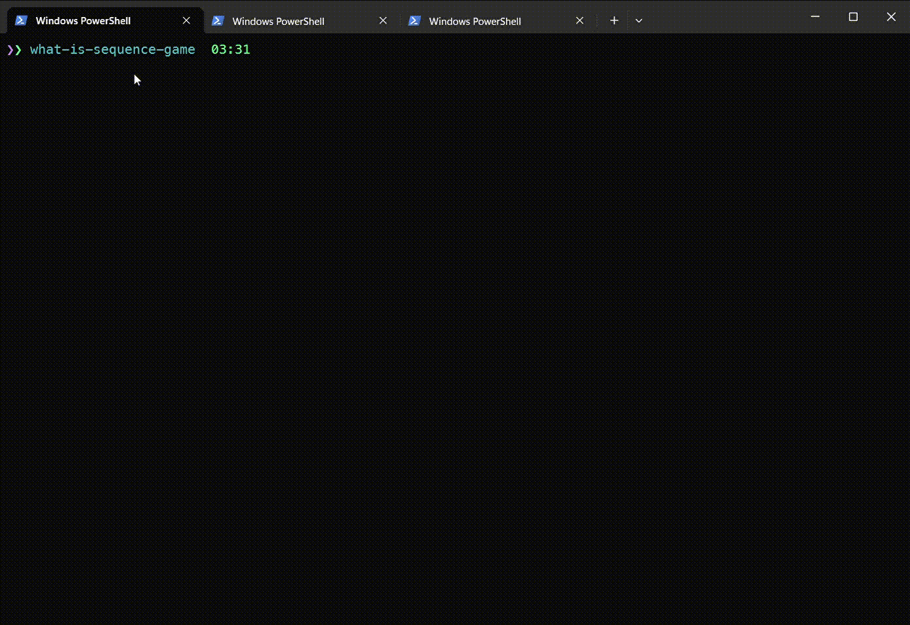
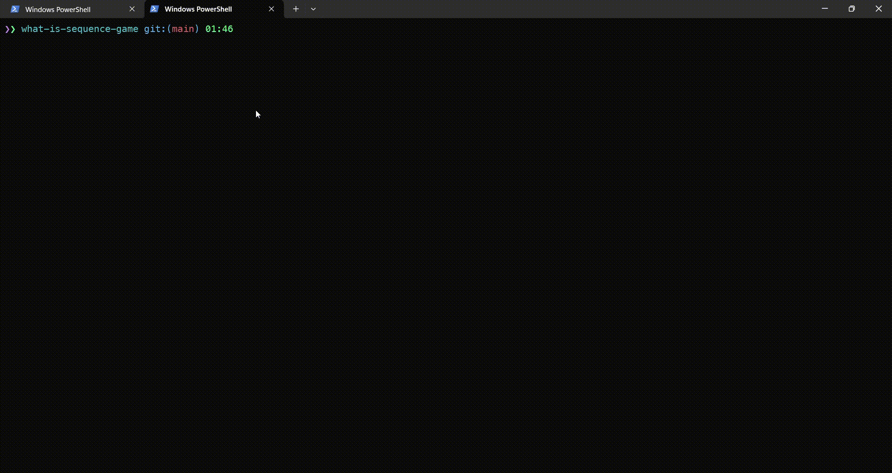

# what-is-sequence-game

> Remember sequence of appearing items and try to restore them in right order - CLI game

There is a box in which appears some items, in some moments all previous shown items disappears and some single item appears.
Your task is to remember each single item that was appeared alone and restore sequence of those items in right order.

## Install

```bash
$ npm install --global what-is-sequence-game
```

## CLI

```
$ what-is-sequence-game --help

  Usage
    $ what-is-sequence-game

  Options
    --emoj Use emojis for sequence
    --chars  Use chars as a sequence items

  Examples
    $ what-is-sequence-game
    $ what-is-sequence-game --emoji
    $ what-is-sequence-game --chars
```

## Demo





## License

MIT © Rushan Alyautdinov

[npm-image]: https://img.shields.io/npm/v/what-is-sequence-game.svg?style=flat
[npm-url]: https://npmjs.org/package/what-is-sequence-game
